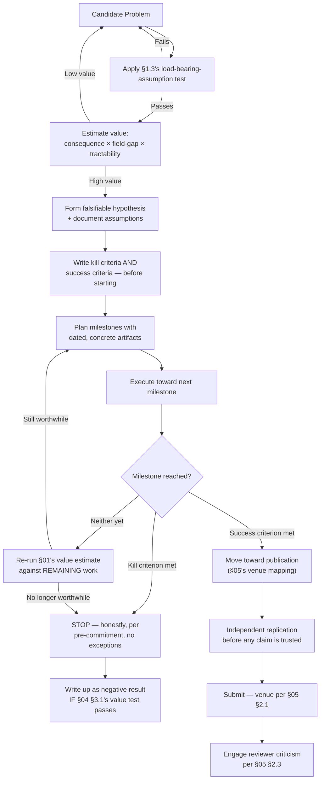

# 08 — Independent Research and the Decision Framework

*Final file of this report — see `00-INDEX-executive-summary.md` for the map. Assumes `01`–`07`. This file's funding-landscape material is grounded in live search conducted for this report; the rest consolidates every prior file into one usable framework.*

---

## 1. Independent Research — Realistic Guidance

### 1.1 The advantages, stated honestly rather than as consolation

An independent researcher has genuine, real advantages this report doesn't want to understate in the course of being honest about the disadvantages below: **no institutional pressure toward incremental, safe, easily-fundable work** (directly easing `01` §3.1's novelty-concentration discipline — an independent researcher can, in principle, place their one deliberate bet on a genuinely unconventional direction more freely than a junior researcher whose career timeline depends on regular, safe publication); and **direct, undiluted ownership of the entire decision framework this report describes** — no negotiating problem selection with a PI's own priorities, no diluting a kill criterion to protect someone else's sunk investment in the direction.

### 1.2 The disadvantages, named specifically and not softened

Restating `05` §1.5's core point directly: the single largest structural disadvantage is the **absence of ambient, informal peer calibration** — companion cryptanalyst-mindset report `07` §1.3's "breadth of scrutiny" finding, and the entire justification companion evaluation-methodology report `01` §1 gives for why evaluation exists as an *external* process, both assume some baseline access to genuinely independent scrutiny that a lab environment provides largely for free (a colleague glancing at a draft, a hallway conversation catching an unstated assumption) and an independent researcher must deliberately, effortfully construct instead. **Compute and funding access** (this file's §2 addresses directly) is a second, concrete disadvantage, distinct from the calibration problem. **Credibility-building** is a third: a first submission from an unaffiliated researcher, with no prior publication record in the field, faces a genuine, if not insurmountable, higher bar for a reviewer's initial trust — not because of any unfairness in principle, but because companion cryptanalyst-mindset report `07` §1.3's breadth-of-scrutiny standard is, in practice, partly inferred from institutional affiliation as a (imperfect, but real) proxy signal reviewers use when direct evidence of a researcher's track record is otherwise unavailable.

### 1.3 Realistic opportunities, calibrated against `01`'s value framework

Directly applying `01` §2.1's three-factor value estimate to the independent-researcher situation specifically: the *most* realistic high-value opportunities are ones scoring well on tractability (§2.2's concrete-first-milestone test) without requiring large compute or institutional access — precisely the profile companion ARX report `09` §1's ranked-opportunities table was built around (several of its entries, like rotation-constant search extension or formal-PRNG-security-proof work, require primarily researcher time and freely-available tooling, not large compute budgets), and companion research-platform report `07` §2's Opportunity #5 (a statistical-rigor reference library) specifically, which requires no cryptography-specific infrastructure at all beyond standard, freely-available statistics libraries.

### 1.4 Common pitfalls specific to independent research

Restating `06` §2's anti-pattern table with the independent-specific instances named: **metric chasing** is especially tempting without a PI or lab colleague to catch it early; **publication pressure** takes a different, self-imposed form (the pressure to demonstrate productivity to funders or to oneself, absent any external deadline structure at all, which can be *harder* to resist than an externally-imposed one precisely because there's no one else's judgment to defer to); and **attachment** (`03` §4) is plausibly *more* acute for an independent researcher whose entire research identity may be invested in a single ongoing direction, without a lab's broader portfolio of projects to provide perspective.

### 1.5 Building credibility, concretely

Restating `05` §2's venue-mapping table with the independent-researcher path made explicit: **IACR ePrint** is the correct, low-barrier first venue for establishing a public track record — free to submit to, indexed and searchable (directly feeding companion research-platform report `06` §4.2's literature-database ingestion, meaning a serious independent contribution genuinely does enter the field's collective knowledge base the same way an institutional one does), and the standard first stop for essentially every eventually-published result per companion design-process report `08` §3.1. **Open-source release** (companion evaluation-methodology report `06` §1.2's artifact-evaluation discipline, applied here as a credibility-building strategy specifically) is a second, complementary path — a well-documented, independently-reproducible reference implementation of a genuinely useful tool (companion research-platform report `07`'s Opportunity #5 again) builds real, checkable credibility through direct usefulness to other researchers, independent of formal publication at all.

## 2. Funding, Grounded in Current, Live Search

### 2.1 NLnet Foundation — the most directly relevant fit, with an important current caveat

**NLnet Foundation**, a Dutch nonprofit funding open-source and open-internet infrastructure since 1997, has a genuine, historical track record funding exactly this report's target domain — its NGI Zero programs have funded WireGuard (companion general-cryptography report `05` §3.2) and, per this session's search record, post-quantum cryptography projects specifically, among many others. Grants typically run **€5,000 to €50,000**, are open to individual, unaffiliated applicants, and — notably, per current guidance — use a genuinely lightweight application process (a short, direct set of questions rather than a lengthy formal proposal), a real, practical fit for `01`'s concrete-first-milestone discipline specifically, since NLnet's own stated evaluation criteria reward exactly the kind of specific, technical, citation-aware project description this report's entire framework is built to help produce. **The important, current caveat, stated precisely rather than glossed over**: as of this report's writing (August 2026), NLnet has **paused new submissions** while transitioning its long-running NGI Zero program to a successor effort, with **new calls expected to open September 3, 2026, deadline November 3, 2026** — anyone pursuing this path should verify NLnet's current call status directly before investing time in an application, since this is exactly the kind of time-sensitive detail liable to have changed further by the time this report is read.

### 2.2 Broader, less domain-specific options, named with appropriate caution

The **Internet Society Foundation's Research Grant Program** offers funding up to $200,000 for independent researchers specifically, with eligibility requiring a postgraduate research degree and a peer-reviewed or independently-published track record (directly connecting to `1.5`'s credibility-building discipline as a prerequisite, not just a parallel goal) — a real, current option per this session's search, though this report has lower confidence in the fully current details of its specific cycle timing and should be verified directly. Cryptography-adjacent AI-safety funding initiatives (the UK AI Security Institute's Alignment Project, per this session's search, has explicitly funded cryptography-relevant research among its cohort) represent a newer, less traditional but genuinely live funding avenue as of 2026, worth investigating if a research direction has any genuine connection to AI-safety-relevant cryptographic questions (the AI-assisted-cryptanalysis thread this entire conversation has traced throughout being one plausible connection point). **Compute-specific grants** (NVIDIA's Academic Grant Program, cloud-provider research-credit programs) are worth pursuing separately from cash funding specifically for the GPU-intensive stages companion research-platform report `05` §2.3 identifies — a smaller, more targeted ask than general research funding, and often correspondingly easier to obtain.

### 2.3 The honest bottom line on funding

None of these sources fund idle exploration — every one of them, per this section's own research, evaluates applications specifically against a concrete, well-scoped project description with a stated deliverable, meaning `01`–`02`'s entire problem-selection and hypothesis-formation discipline is not merely good research practice in the abstract for an independent researcher — it is the literal, direct prerequisite for a fundable application, making this report's framework and this section's funding landscape two halves of the same practical answer, not separate topics.

---

## 3. The Consolidated Decision-Making Framework

Synthesizing `01`–`07` into the single, usable framework your outline's Part 14 asks for:

### 3.1 What this framework is, and isn't

This is not a guarantee of good outcomes — per `04`'s entire risk taxonomy, no framework eliminates cryptanalysis risk, career risk, or genuine bad luck. What it is, restated one final time as this report's closing claim: a **structural defense against the specific, recurring, well-documented ways researchers — including excellent ones — go wrong for reasons that have nothing to do with their technical skill**: confirmation bias, sunk cost, attachment, publication pressure, metric chasing, and the quiet, invisible accumulation of opportunity cost. Every companion report in this eight-report conversation has, in its own domain, converged on some version of the same underlying instinct — state your claims precisely, seek out the evidence that would prove you wrong, and be honest about what you actually have versus what you hope you have. This report's only real addition is making that instinct explicit enough, at the level of an entire research career rather than a single evaluation, to actually build a practice around.

---

This closes the eight-file report on research decision-making, and with it, the eighth report in this conversation's research program. If you build the platform companion research-platform report `07` roadmaps, design the ARX permutation and PRNG this entire conversation has been oriented toward, and evaluate it against companion evaluation-methodology report `08`'s pipeline — the actual, remaining variable this report has tried to address is not whether you have the technical knowledge (seven prior reports have tried to supply that) but whether you make the decisions along the way with the same rigor you'd apply to the cryptography itself. That's the only thing this report could add that the others couldn't.
